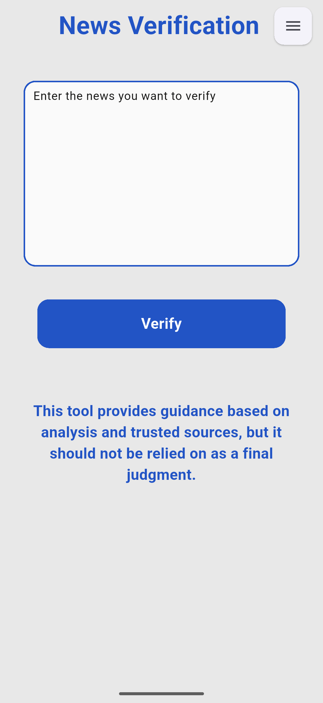
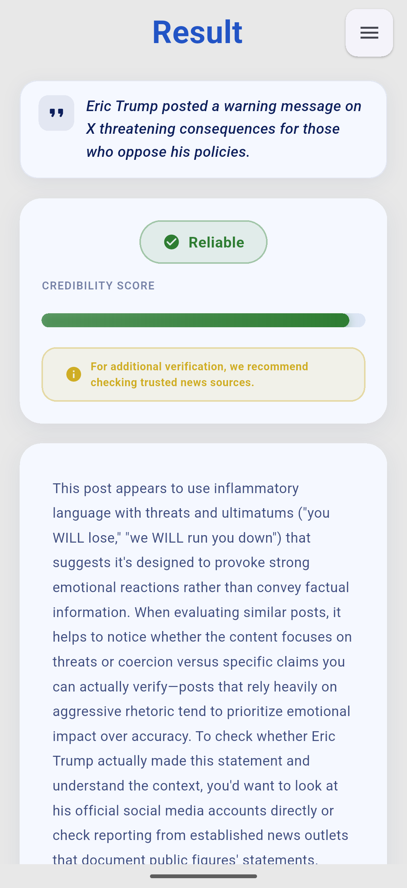

# News Insight — Fake News Detection System

A mobile application that helps users evaluate the credibility of news text using a fine-tuned DistilRoBERTa model, supported by Google Fact Check and AI-generated awareness explanations.

---

## Repository Structure

| Folder | Contents |
|---|---|
| `dataset/` | Final merged dataset (train, test, validation CSV files) |
| `notebooks/` | Dataset merging and model training notebooks |
| `training/` | SageMaker training script |
| `backend/` | FastAPI backend source code |
| `app/` | Compiled Android APK for direct installation |
| `flutter_app/` | Full Flutter application source code |

---

## System Overview

The system combines three components:

1. **DistilRoBERTa model** — fine-tuned on a merged dataset (~98,000 samples from WELFake, MultiFC, and ISOT) and deployed as an AWS SageMaker inference endpoint.
2. **Google Fact Check API** — searches for existing fact-check results matching the submitted claim. When a match is found, it takes priority over the model as the final result.
3. **Anthropic Claude Haiku** — extracts the core claim from the input text and generates a plain-language awareness explanation.

---

## Dataset

The final dataset merges three sources:

| Dataset | Type |
|---|---|
| WELFake | Long-form news articles |
| MultiFC | Short claims from multiple fact-checking sources |
| ISOT | Long-form news articles |

The CSV files in `dataset/` are the final cleaned and split versions used for training.

---

## Model Training

Training was done on AWS SageMaker using an `ml.g4dn.xlarge` GPU instance. See `notebooks/distilroberta_final_v.ipynb` for the full training pipeline including dataset upload, training job configuration, endpoint deployment, and evaluation.

| Parameter | Value |
|---|---|
| Model | distilroberta-base |
| Learning rate | 2e-5 |
| Batch size | 16 (train) / 32 (eval) |
| Max sequence length | 512 |
| Weight decay | 0.05 |
| Label smoothing | 0.05 |
| Early stopping patience | 2 (based on weighted F1) |

---

## System Components

| Component | Technology | Description |
|---|---|---|
| Model | DistilRoBERTa on AWS SageMaker | Fine-tuned for binary fake news classification and deployed as a real-time inference endpoint |
| Backend | FastAPI on AWS EC2 | REST API that connects the mobile app to the model endpoint and external APIs |
| Mobile App | Flutter | Cross-platform mobile application for Android |
| Authentication & History | Firebase | User authentication and analysis history storage |
| External APIs | Google Fact Check, Anthropic Claude Haiku | External fact-checking and awareness explanation generation |

---

## Notebooks

| Notebook | Purpose |
|---|---|
| `Merged_Dataset.ipynb` | Merging WELFake, MultiFC, and ISOT into a unified dataset |
| `distilroberta_final_v.ipynb` | Full model pipeline: tokenization, SageMaker training, evaluation, and endpoint deployment |

---

## API Endpoints

| Method | Endpoint | Description |
|---|---|---|
| GET | `/health` | Returns service status |
| POST | `/analyze` | Analyses news text and returns credibility result |

**Request body (`/analyze`):**
```json
{
  "text": "Your news text here (max 400 words)"
}
```

**Response includes:** model label, confidence score, fact-check results, extracted claim, awareness explanation, and verification prompt.

---

## Screenshots

<p align="center">
  
  &nbsp;&nbsp;&nbsp;
  
  &nbsp;&nbsp;&nbsp;
  
</p>

<p align="center">
  <em>Home &nbsp;&nbsp;&nbsp;&nbsp;&nbsp;&nbsp;&nbsp;&nbsp;&nbsp;&nbsp;&nbsp;&nbsp; Reliable Result &nbsp;&nbsp;&nbsp;&nbsp;&nbsp;&nbsp;&nbsp;&nbsp;&nbsp;&nbsp;&nbsp;&nbsp; Misleading Result</em>
</p>

---

## Built With

- [DistilRoBERTa](https://huggingface.co/distilroberta-base) — transformer model for text classification
- [AWS SageMaker](https://aws.amazon.com/sagemaker/) — model training and deployment
- [AWS EC2](https://aws.amazon.com/ec2/) — backend hosting
- [FastAPI](https://fastapi.tiangolo.com/) — backend framework
- [Flutter](https://flutter.dev/) — mobile application
- [Firebase](https://firebase.google.com/) — authentication and history storage
- [Google Fact Check Tools API](https://developers.google.com/fact-check/tools/api) — external fact-checking
- [Anthropic Claude Haiku](https://www.anthropic.com/) — claim extraction and awareness generation

---

